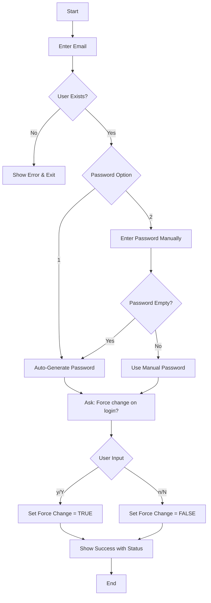

# Zimbra Password Reset Tool 🔐

A simple yet powerful Bash script for Zimbra administrators to reset user passwords with flexible options including auto-generation, manual entry, and force password change on next login.


---

## ✨ Features

- ✅ **User Validation** - Checks if the email exists before resetting
- ✅ **Auto-Generate Password** - Creates a secure 12-character random password (letters & numbers)
- ✅ **Manual Password Entry** - Allows administrators to set custom passwords
- ✅ **Smart Fallback** - Auto-generates password if manual entry is empty
- ✅ **Force Change on Login** - Option to force users to change password on first login


---

## 📦 Prerequisites

- Zimbra Collaboration Suite (Network or Open Source Edition)
- Shell access to the Zimbra server
- Must run as the `zimbra` user

```bash
# Switch to zimbra user
su - zimbra
```

---

## 🚀 Quick Start

### One-Liner (Run Directly)

```bash
bash -c "$(curl -fsSL https://raw.githubusercontent.com/janak0ff/script-forest/zimbra-email-pass-reset/pass-reset.sh)"
```

---

## 📖 Usage

### Interactive Mode

The script will guide you through:

1. **Enter Email** - Type the user's email address
2. **Choose Password Option** - Auto-generate or enter manually
3. **Set Force Change** - Choose if user must change password on next login
4. **View Results** - See the new password and status

### Password Options

| Option | Description |
|--------|-------------|
| `1` | Auto-generate a secure 12-character password |
| `2` | Enter a custom password manually |

### Force Change Options

| Option | Result |
|--------|--------|
| `y` / `Y` | User must change password on next login |
| `n` / `N` | User can login with the current password |

---

## 📝 Examples

### Example 1: Auto-Generate Password

```bash
[zimbra@store ~]$ bash -c "$(curl -fsSL https://raw.githubusercontent.com/janak0ff/script-forest/zimbra-email-pass-reset/pass-reset.sh)"
========================================
     Zimbra's Password Reset Tool
========================================
Enter user email: john.doe@company.com

Password options:
  1) Auto-generate password (default)
  2) Enter password manually
Choose (1 or 2): 1

Must change password on next login? (y/n): y

========================================
SUCCESS
========================================
Email:    john.doe@company.com
Password: aB3xY7kL9mN2
Status:   Must change on next login
========================================
```

### Example 2: Manual Password Entry

```bash
[zimbra@store ~]$ bash -c "$(curl -fsSL https://raw.githubusercontent.com/janak0ff/script-forest/zimbra-email-pass-reset/pass-reset.sh)"
========================================
     Zimbra's Password Reset Tool
========================================
Enter user email: jane.smith@company.com

Password options:
  1) Auto-generate password (default)
  2) Enter password manually
Choose (1 or 2): 2

Enter new password: 

Must change password on next login? (y/n): n

========================================
SUCCESS
========================================
Email:    jane.smith@company.com
Password: SecurePass123
Status:   Can login with current password
========================================
```

### Example 3: Empty Manual Entry (Auto-Fallback)

```bash
[zimbra@store ~]$ bash -c "$(curl -fsSL https://raw.githubusercontent.com/janak0ff/script-forest/zimbra-email-pass-reset/pass-reset.sh)"
========================================
     Zimbra's Password Reset Tool
========================================
Enter user email: test.user@company.com

Password options:
  1) Auto-generate password (default)
  2) Enter password manually
Choose (1 or 2): 2

Enter new password: 
No password entered. Using auto-generated password...

Must change password on next login? (y/n): y

========================================
SUCCESS
========================================
Email:    test.user@company.com
Password: xY7kL9mN2aB3
Status:   Must change on next login
========================================
```

### Example 4: User Not Found

```bash
[zimbra@store ~]$ bash -c "$(curl -fsSL https://raw.githubusercontent.com/janak0ff/script-forest/zimbra-email-pass-reset/pass-reset.sh)"
========================================
     Zimbra's Password Reset Tool
========================================
Enter user email: fakeuser@company.com
ERROR: User 'fakeuser@company.com' does not exist
```

---

## 📊 Script Flow



---

## 📋 Quick Reference

| Command | Purpose |
|---------|---------|
| `bash -c "$(curl -fsSL https://raw.githubusercontent.com/janak0ff/script-forest/zimbra-email-pass-reset/pass-reset.sh)"` | Run the interactive password reset tool |
| `zmprov -l gaa` | List all users |
| `zmprov -l ga user@domain.com` | Check if user exists |
| `zmprov -l sp user@domain.com 'NewPass'` | Reset password directly |
| `zmprov -l ma user@domain.com zimbraPasswordMustChange TRUE` | Force change on next login |
| `zmprov -l ma user@domain.com zimbraPasswordMustChange FALSE` | Allow login with current password |