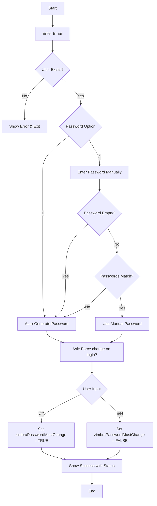

# Zimbra Password Reset Tool 🔐

A simple yet powerful Bash script for Zimbra administrators to reset user passwords with flexible options including auto-generation, manual entry, and force password change on next login.


## ✨ Features

- ✅ **User Validation** - Checks if the email exists before resetting
- ✅ **Auto-Generate Password** - Creates a secure 12-character random password (letters & numbers)
- ✅ **Manual Password Entry** - Allows administrators to set custom passwords
- ✅ **Smart Fallback** - Auto-generates password if manual entry is empty or mismatched
- ✅ **Force Change on Login** - Option to force users to change password on first login


## 📦 Prerequisites

Make sure you're running as the `zimbra` user:

```bash
su - zimbra
```


## 📖 Usage

```bash
bash -c "$(curl -fsSL https://raw.githubusercontent.com/janak0ff/script-forest/zimbra-email-pass-reset/pass-reset.sh)"
```

## 📝 Examples

### Example 1: Reset with Auto-Generated Password

```bash
[zimbra@mail ~]$ bash -c "$(curl -fsSL https://raw.githubusercontent.com/janak0ff/script-forest/zimbra-email-pass-reset/pass-reset.sh)"
========================================
     Zimbra's Password Reset Tool
========================================
Enter user email: john.doe@company.com

Password options:
  1) Auto-generate password (default)
  2) Enter password manually
Choose (1 or 2): 1

Must change password on next login? (y/n): y

========================================
              ✅ SUCCESS
========================================
📧 Email:    john.doe@company.com
🔑 Password: aB3xY7kL9mN2
📌 Status:   🔒 Must change on next login
========================================

User can login at: https://mail.company.com/
```

### Example 2: Reset with Manual Password

```bash
[zimbra@mail ~]$ bash -c "$(curl -fsSL https://raw.githubusercontent.com/janak0ff/script-forest/zimbra-email-pass-reset/pass-reset.sh)"
========================================
     Zimbra's Password Reset Tool
========================================
Enter user email: jane.smith@company.com

Password options:
  1) Auto-generate password (default)
  2) Enter password manually
Choose (1 or 2): 2

Enter new password: 
Confirm password: 

Must change password on next login? (y/n): n

========================================
              ✅ SUCCESS
========================================
📧 Email:    jane.smith@company.com
🔑 Password: SecurePass123
📌 Status:   🔓 Can login with current password
========================================

User can login at: https://mail.company.com/
```

### Example 3: Manual Password with Fallback

```bash
[zimbra@mail ~]$ bash -c "$(curl -fsSL https://raw.githubusercontent.com/janak0ff/script-forest/zimbra-email-pass-reset/pass-reset.sh)"
========================================
     Zimbra's Password Reset Tool
========================================
Enter user email: test.user@company.com

Password options:
  1) Auto-generate password (default)
  2) Enter password manually
Choose (1 or 2): 2

Enter new password: 
Confirm password: 

⚠️ No password entered. Using auto-generated password...

Must change password on next login? (y/n): y

========================================
              ✅ SUCCESS
========================================
📧 Email:    test.user@company.com
🔑 Password: xY7kL9mN2aB3
📌 Status:   🔒 Must change on next login
========================================

User can login at: https://mail.company.com/
```

### Example 4: User Not Found

```bash
[zimbra@mail ~]$ bash -c "$(curl -fsSL https://raw.githubusercontent.com/janak0ff/script-forest/zimbra-email-pass-reset/pass-reset.sh)"
========================================
     Zimbra's Password Reset Tool
========================================
Enter user email: fakeuser@company.com
ERROR: User 'fakeuser@company.com' does not exist

Tip: Use 'zmprov -l gaa' to list all users
```

## 📊 Script Flow



---

## Quick Reference

| Command | Purpose |
|---------|---------|
| `bash -c "$(curl -fsSL https://raw.githubusercontent.com/janak0ff/script-forest/zimbra-email-pass-reset/pass-reset.sh)"` | Run the interactive password reset tool |
| `zmprov -l gaa` | List all users |
| `zmprov -l ga user@domain.com` | Check if user exists |
| `zmprov -l sp user@domain.com 'NewPass'` | Reset password directly |
| `zmprov -l ma user@domain.com zimbraPasswordMustChange TRUE` | Force change on next login |

---